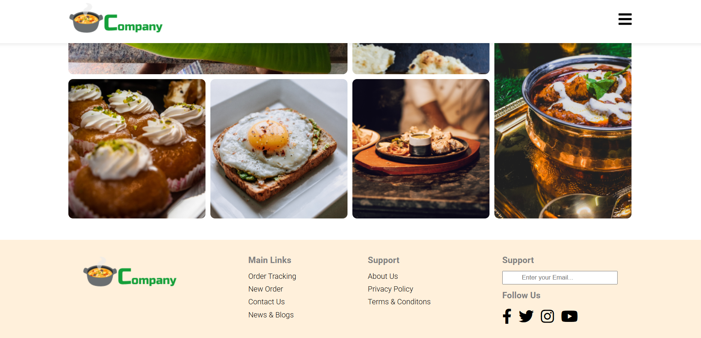
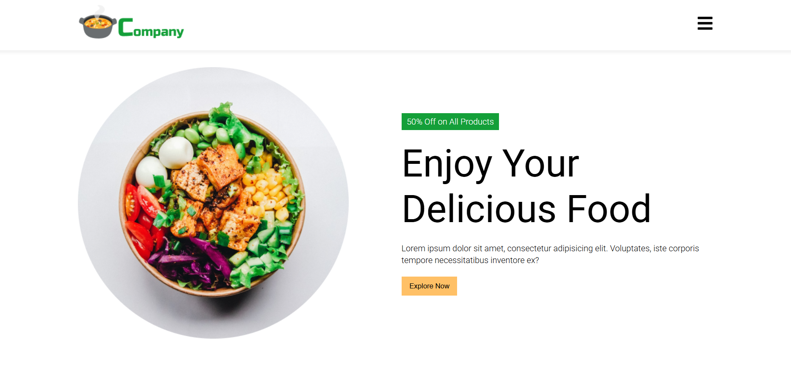
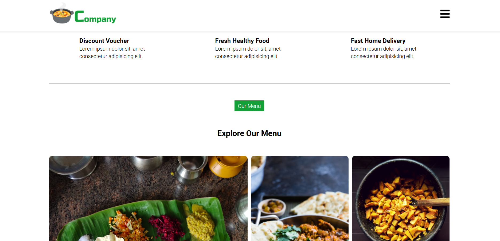

🍽️ **A simple and responsive restaurant website** built using 🌐 HTML and 🎨 CSS for practice and learning purposes. This project showcases a stylish landing page for a fictional restaurant, complete with a 🍴 menu, 🧑‍🍳 about section, and 📞 contact info.

## Screenshots

## 🌟 Features

- 📱 **Responsive Design**
- 🍕 **Menu Section**
- 🧑‍🍳 **About Us Section**
- 📍 **Contact Section**
- 🎨 **Clean and Modern Layout**

## 🔧 Built With

- 🛠️ HTML5  
- 🎨 CSS3
